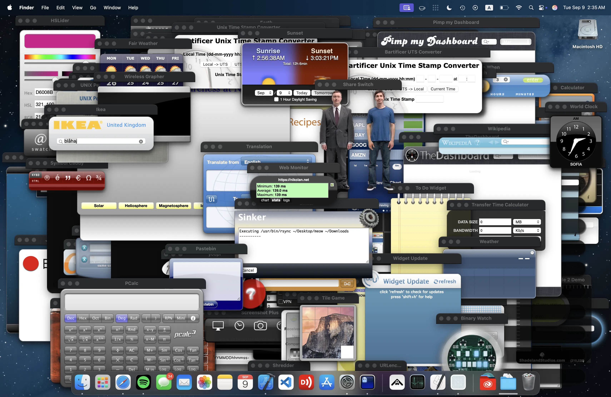

<h1 align="center">Widget Porting Toolkit</h1>

<p align="center">
  
  
  
  
</p>

<p align="center">
  Allows you to run Dashboard widgets (OS X 10.4 - 10.14) on new macOS versions (12.0+).
</p>



<p align="center">
  <a href="https://github.com/nikolan123/WidgetPortingToolkit/releases/download/nightly/Widget.Porting.Toolkit.dmg">
    
  </a>
  <br>
  macOS 12.0 or later. Intel & Apple Silicon. Nightly build
</p>

<p align="center">
  <a href="https://widgets.nikolan.net">Project Website</a>
  •
  <a href="https://widgets.nikolan.net/qsg.html">Quick Start Guide</a>
  •
  <a href="https://blog.nikolan.net/posts/dashboard-widgets/">Blog Post</a>
</p>

<p align="center">This is a side project made in my free time to learn Swift. Parts of the code are messy. Contributions always welcome.</p>

## Getting Started

```bash
git clone https://github.com/nikolan123/WidgetPortingToolkit.git
cd WidgetPortingToolkit
open WidgetPortingAPP.xcodeproj
```

1. Build and run in Xcode
2. Use the menu to install the Support Directory
3. Drag .wdgt bundles into the app

## Resources

[Dashboard Reference](https://adc09.nikolan.net/documentation/AppleApplications/Reference/Dashboard_Ref/DashboardRef/DashboardRef.html)

[Dashboard Programming Topics](https://adc09.nikolan.net/documentation/AppleApplications/Conceptual/Dashboard_ProgTopics/Introduction/Introduction.html)

[Kludgets](https://github.com/icedman/kludgets)
